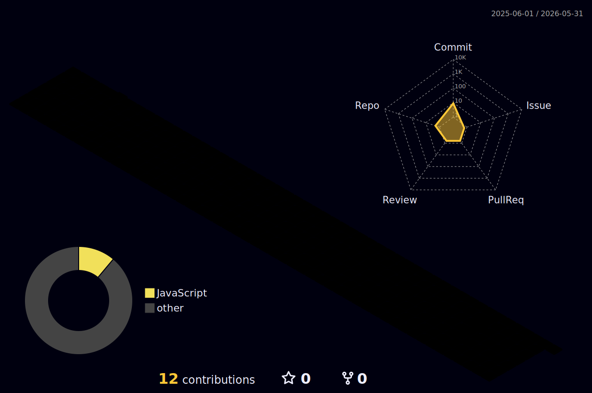

<div align="center">
  

  <h3>🧠 Computer Science Engineering Student | Full-Stack Web Developer | AI Enthusiast 🚀</h3>
  
  <p align="center">
    <a href="https://www.linkedin.com/in/prince-kumar-a15aba387/" target="_blank">
      
    </a>
    <a href="https://www.instagram.com/prince.singh.21/" target="_blank">
      
    </a>
  </p>

  <p align="center">
    I am a passionate computer science engineering student exploring the world of modern web development, intelligent AI features, and backend architectures. Always building, always learning.
  </p>
</div>

---

### 🛠️ Tech Stack & Skills

<p align="center">
  
  
  
  <br/><br/>
  
  
  
  
  <br/><br/>
  
  
  
</p>

---

### 📊 My GitHub Journey

<div align="center">
  <!-- Dynamic GitHub Status Cards -->
  
  
</div>

<br/>

<div align="center">
  <!-- GitHub Streak -->
  
</div>

<br/>

### 🌌 3D Contributions Calendar

<div align="center">
  <!-- This image will appear once you run the GitHub Action to generate it -->
  
</div>

<br/>

> **To make the 3D Graph appear**, you must configure a scheduled GitHub Action in your profile repository.
> 1. In your `princesingh9/princesingh9` repository, create a folder structure: `.github/workflows/`
> 2. Inside that, create a file named `profile-3d.yml`.
> 3. Paste the following Action Code into that file and commit it. The 3D graph will generate automatically every day!
> 
> <details>
> <summary>Click here for the GitHub Action Code to copy</summary>
> 
> ```yaml
> name: GitHub-Profile-3D-Contrib
> 
> on:
>   schedule: # 03:00 JST == 18:00 UTC
>     - cron: "0 18 * * *"
>   workflow_dispatch:
> 
> jobs:
>   build:
>     runs-on: ubuntu-latest
>     name: generate-github-profile-3d-contrib
>     steps:
>       - uses: actions/checkout@v3
>       - uses: yoshi389111/github-profile-3d-contrib@0.7.1
>         env:
>           GITHUB_TOKEN: ${{ secrets.GITHUB_TOKEN }}
>           USERNAME: ${{ github.repository_owner }}
>       - name: Commit & Push
>         run: |
>           git config user.name github-actions
>           git config user.email github-actions@github.com
>           git add -A .
>           git commit -m "generated 3d contribution graph"
>           git push
> ```
> </details>

---

### ⚡ What I'm Up To
- 🔭 Currently exploring: **Advanced Full-Stack Engineering and Machine Learning integration (AI).**
- 🌱 Currently learning: **Deeper concepts of modern Backend engineering & Python AI APIs.**
- 👯 Looking to collaborate on: **Open source React & Python projects.**
- 📫 Connect with me: [LinkedIn](https://www.linkedin.com/in/prince-kumar-a15aba387/) | [Instagram](https://www.instagram.com/prince.singh.21/)

<div align="center">
  
</div>
